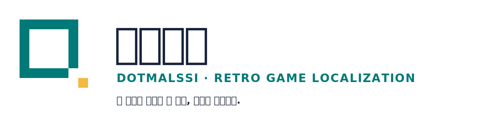

<p align="center">
  
</p>

# 도트말씨 홈페이지

도트말씨의 프로젝트 현황, 네 실행 자리, 독립 검수와 안전한 배포 원칙을
소개하는 공식 홈페이지 소스입니다.

> 옛 게임의 말씨를 한 칸씩, 근거로 완성한다.

- 홈페이지: <https://dotmalssi.eyj0604.chatgpt.site>
- 공개 저장소: <https://github.com/eyj0604/dotmalssi-homepage>
- 현재 공개 버전: `0.1.1`
- 다음 로컬 후보: `0.1.2`
- 향후 계획과 권리 경계: [ROADMAP.md](ROADMAP.md)
- 자동화·이용자 글 DB 경계: [AUTOMATION.md](AUTOMATION.md)

## 현재 범위

- 한국어 단일 페이지
- 프로젝트 상태와 다음 게이트
- 매듭·이음·되짚·눈금 역할 소개
- 번역·독립 검수·기술 QA·사용자 승인 흐름
- ROM 미배포와 정확한 릴리스 승인 원칙
- Open Graph, canonical, 구조화 데이터, 반응형·키보드 접근성

패치 다운로드와 브라우저 패처는 v1에 포함하지 않습니다. 정확한 릴리스
산출물과 해시가 별도 승인된 뒤에만 추가합니다.

## 공개 반영 흐름

이 작업실에서 만든 변경이 검증 없이 곧바로 공개 홈페이지에 올라가지는 않습니다.

1. 홈페이지 전용 공개 파일만 변경합니다.
2. 자동 검사와 제작자와 다른 검수자의 검토를 통과합니다.
3. 사용자가 정확한 revision을 승인합니다.
4. 승인된 revision만 GitHub와 OpenAI Sites에 1회 반영합니다.

수동 스프린트 세 번이 상태 드리프트 없이 끝나기 전에는 반복 쓰기 자동화를
켜지 않습니다. 첫 자동화도 공개 쓰기가 아니라 읽기 전용 현황 보고부터 시작합니다.

## 로컬 실행

Node.js 22.13 이상이 필요합니다.

```bash
npm ci
npm run dev
```

검증:

```bash
npm test
npm run lint
npm run typecheck
npm run security
npm run repo:check
npm run release:readiness
```

## 자동화와 이용자 글

v0.1.2 후보가 정확한 revision 승인을 받아 공개되면 첫 주간 작업은 매주 금요일
21:17(Asia/Seoul)에 실행되는 읽기 전용 배포 준비 점검이다. 현재 공개 v0.1.1에는
아직 실행되지 않는다. 수동 패치 릴리스 스프린트 세 번과 별도 승인이 끝나기 전에는
GitHub Release나 홈페이지를 자동으로 수정하지 않는다.

이용자 글은 D1에서 90일 뒤 처리·공개 대상에서 제외하되 원문 이메일은 저장하지
않는다. 로그인 식별값은 런타임 비밀값과 함께 해시해 별도 도배 방지 표에서 2시간
뒤 사용을 중단한다. 물리 삭제 반복 작업은 아직 승인되지 않았으므로 글 접수 스위치
`FEEDBACK_WRITE_ENABLED`의 기본값은 `false`다. 글은 `pending`으로만 접수되고
사람이 승인한 뒤에만 답변 큐에 들어갈 수 있다. 브라우저에 전달되는 철회키로 본인
글을 삭제할 수 있으며, 답변 생성과 자동 공개는 현재 모두 꺼져 있다. 배포 환경은
빈 변수명만 적힌 `.env.example`을 참고해 32바이트 이상의 실제
`FEEDBACK_ID_PEPPER`를 호스팅 비밀값으로 별도 설정해야 한다.

## 저장소 안전선

이 저장소에는 원본·패치 ROM, BIOS, 세이브, 세이브스테이트, 비밀키 또는
개인정보를 넣지 않습니다. 공개 배포는 로컬 빌드 완료와 별개의 승인 작업입니다.

외부 ROM 다운로드 링크도 자동으로 허용하지 않습니다. 공식 판매처, 권리자가
직접 제공하는 다운로드, 또는 재배포 조건이 확인된 홈브루·공개 라이선스 자료만
출처와 권리 근거를 기록한 뒤 후보로 검토합니다.

## 브랜드

`public/brand/`의 도트말씨 로고는 승인된 공용 정본의 바이트 복사본입니다.
팀명·로고의 상업 이용, 굿즈, 상표 출원 또는 재라이선스는 별도 권리 검토와
승인 없이는 허용된 것으로 보지 않습니다.

비공식 팬 한글화이며 원작 권리자와 무관합니다.
